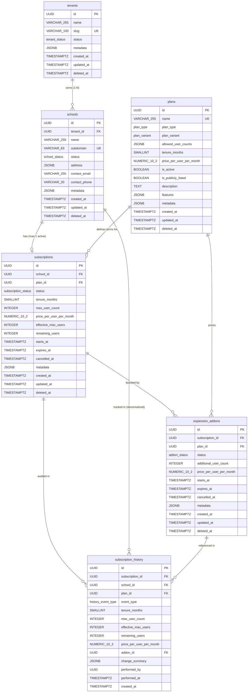

# SmartSync Platform Service — Definitive Schema Specification

**Service**: `platform`
**PostgreSQL Schema**: `platform`
**SQLAlchemy Version**: 2.0+ (Mapped Declarative Style)
**Repository**: `smartsync-db-schema/platform-service`
**Last Updated**: 2026-06-23

---

## Table of Contents

1. [Domain Scope & Service Boundaries](#1-domain-scope--service-boundaries)
2. [Global Data Type Rationale](#2-global-data-type-rationale)
3. [Architectural Decisions Log](#3-architectural-decisions-log)
   - [ADR-1: allowed_user_counts Storage](#adr-1-allowed_user_counts--database-jsonb-on-plans)
   - [ADR-2: Tenure & Pricing Snapshotting](#adr-2-tenure--pricing--snapshot-into-subscriptions)
   - [ADR-3: is_active vs is_publicly_listed](#adr-3-is_active-vs-is_publicly_listed--keep-both)
   - [ADR-4: Addon Modeling](#adr-4-addon-modeling--relational-table)
   - [ADR-5: SchoolStatus Purity](#adr-5-schoolstatus--pure-operational-no-billing-states)
   - [RD-1: Tenure CHECK Constraint](#rd-1-tenure-check-constraint--boundary-range-160-months)
   - [RD-2: remaining_users Update Strategy](#rd-2-remaining_users-update-strategy--app-layer-batch-writes)
   - [RD-3: performed_by Cross-Service FK](#rd-3-performed_by--loose-uuid-no-cross-schema-fk)
4. [Enum Type Catalog](#4-enum-type-catalog)
5. [Entity Specifications](#5-entity-specifications)
   - [5.1 tenants](#51-tenants)
   - [5.2 schools](#52-schools)
   - [5.3 plans](#53-plans)
   - [5.4 subscriptions](#54-subscriptions)
   - [5.5 expansion_addons](#55-expansion_addons)
   - [5.6 subscription_history](#56-subscription_history)
6. [Constraint Protection Matrix](#6-constraint-protection-matrix)
7. [Partial Unique Indexes — Concurrency Deep-Dive](#7-partial-unique-indexes--concurrency-deep-dive)
8. [Soft-Delete Architecture](#8-soft-delete-architecture)
9. [Entity-Relationship Diagram](#9-entity-relationship-diagram)
10. [Appendix: Naming Conventions](#10-appendix-naming-conventions)

---

## 1. Domain Scope & Service Boundaries

### Purpose

The `platform` schema is the **organizational and subscription management** backbone of SmartSync. It answers three questions:

1. **Who is on the platform?** → Tenants and Schools
2. **What are they paying for?** → Plans and Subscriptions
3. **What happened?** → Subscription History (immutable audit log)

### What Is IN Scope

| Concern | Entities | Rationale |
|---|---|---|
| Multi-tenant hierarchy | `tenants`, `schools` | Organizational containment — a tenant owns schools |
| Product catalog | `plans` | Immutable pricing definitions (CORE/GROWTH × ENTRY/SCALABLE) |
| Active entitlement | `subscriptions` | The school's current service agreement and capacity counters |
| Mid-term capacity boosts | `expansion_addons` | Additional users purchased during an active subscription term |
| Audit trail | `subscription_history` | Append-only, immutable record of every lifecycle event |

### What Is INTENTIONALLY OUT OF Scope

| Concern | Why Excluded | Where It Lives Instead |
|---|---|---|
| **Payment invoices** | Invoicing is a financial concern with its own lifecycle (draft → sent → paid → void). Mixing it here would bloat the platform schema and couple operational state to payment gateway latency. | Dedicated `billing` service/schema |
| **Payment gateway transactions** | Gateway responses (Razorpay, Stripe) have their own idempotency keys, webhook reconciliation, and retry logic. These are infrastructure concerns, not domain concerns. | Dedicated `payments` service/schema |
| **User accounts & authentication** | User identity, passwords, OAuth tokens, and session management are security-critical concerns that evolve independently. | Dedicated `identity` / `auth` service/schema |
| **Academic modules** | Attendance, gradebook, timetable, transport — these are feature modules gated by `plans.features`, not part of the platform substrate. | Per-module schemas (e.g., `academics`, `transport`) |
| **Notifications & emails** | Transactional emails, push notifications, and SMS are cross-cutting infrastructure. | Dedicated `notifications` service |
| **Repository / query logic** | Data access patterns, CRUD operations, and business query methods are application-layer concerns that evolve independently of the schema. | Downstream Platform Service application layer |

> [!IMPORTANT]
> **The `platform` schema has zero foreign keys pointing outward to any other service's tables.** The only cross-service reference is `subscription_history.performed_by`, which is a **loose UUID** with no FK constraint (see [RD-3](#rd-3-performed_by--loose-uuid-no-cross-schema-fk)). This guarantees that the platform service can be deployed, migrated, and rolled back independently.

### Repository Structure

This specification governs the `smartsync-db-schema/platform-service` repository, which contains **only** the database layer:

```
smartsync-db-schema/platform-service/
├── alembic/
│   ├── env.py                          ← Migration environment (platform schema scoped)
│   ├── script.py.mako                  ← Migration template
│   └── versions/                       ← Generated migration files
├── alembic.ini                          ← Alembic configuration
├── app/
│   ├── __init__.py
│   ├── db/
│   │   ├── __init__.py
│   │   ├── base.py                     ← PlatformBase, PLATFORM_SCHEMA, naming conventions
│   │   ├── mixins.py                   ← PrimaryKeyMixin, TimestampMixin, SoftDeleteMixin, AuditOnlyMixin
│   │   └── session.py                  ← Async engine + session factory (for Alembic connectivity)
│   └── models/
│       ├── __init__.py                 ← Re-exports all models + enums for Alembic discovery
│       ├── base.py                     ← Convenience re-export of PlatformBase
│       ├── enums.py                    ← All 7 PostgreSQL enum types
│       ├── tenant.py                   ← Tenant model
│       ├── school.py                   ← School model
│       ├── plan.py                     ← Plan model
│       ├── subscription.py             ← Subscription model
│       ├── expansion_addon.py          ← ExpansionAddon model
│       └── subscription_history.py     ← SubscriptionHistory model (append-only)
└── requirements.txt                     ← Python dependencies
```

> [!NOTE]
> This repository does **not** contain `app/repositories/`, API routes, or application-layer business logic. Query patterns, CRUD operations, and domain service methods live in the downstream Platform Service application repository.

---

## 2. Global Data Type Rationale

Every column in this schema uses a deliberately chosen PostgreSQL type. The rationale for each category is documented once here and referenced throughout the entity specifications.

### UUID (`uuid` / `gen_random_uuid()`) — Why Not Serial Integers?

| Factor | UUID | SERIAL / BIGSERIAL |
|---|---|---|
| **Multi-service safety** | IDs are globally unique across all services. Two independently created subscriptions will never collide, even across database shards. | Sequential integers are only unique within a single table. Cross-service references require composite keys or namespacing. |
| **Security** | Opaque — an attacker cannot enumerate resources by incrementing an ID. | Predictable — exposing `/api/schools/42` reveals there are at least 42 schools. |
| **Distributed generation** | Generated client-side or by any node without coordination (no sequence lock). | Requires a centralized sequence, which becomes a bottleneck in distributed writes. |
| **Merge/import safety** | Tenant data imports from external systems never collide with existing IDs. | Integer collision requires remapping, which is error-prone. |
| **Storage cost** | 16 bytes per UUID. Marginal overhead at our scale (< 1M rows per table). | 4–8 bytes. Savings are negligible compared to the operational risks above. |

**Implementation**: `server_default=func.gen_random_uuid()` — PostgreSQL generates UUIDs server-side, so the application never needs to import a UUID library for ID generation.

---

### TIMESTAMP WITH TIME ZONE (`TIMESTAMPTZ`) — Why Not Naive Timestamps?

| Factor | `TIMESTAMPTZ` | `TIMESTAMP` (naive) |
|---|---|---|
| **Multi-timezone correctness** | PostgreSQL converts and stores all timestamps in UTC internally. Queries from IST, EST, or UTC all return correct results. | Stores the literal value without timezone context. A `2026-06-23 10:00:00` inserted by an IST server and queried by a UTC server is silently wrong by 5:30 hours. |
| **DST safety** | Immune to daylight saving time ambiguities. | Ambiguous during DST transitions (does `02:30:00` mean before or after the clock change?). |
| **Regulatory compliance** | Indian school ERP must handle IST natively. `TIMESTAMPTZ` lets the DB store UTC and the app layer present IST. | Would require manual timezone arithmetic in every query — a guaranteed source of bugs. |

**Rule**: Every temporal column in this schema — `created_at`, `updated_at`, `deleted_at`, `starts_at`, `expires_at`, `cancelled_at`, `performed_at` — is `TIMESTAMPTZ`. No exceptions.

---

### NUMERIC(10,2) — Why Not FLOAT or DOUBLE PRECISION for Money?

| Factor | `NUMERIC(10,2)` | `FLOAT` / `DOUBLE PRECISION` |
|---|---|---|
| **Exactness** | Arbitrary-precision decimal. `₹199.99` is stored as exactly `199.99`. | IEEE 754 floating point. `₹199.99` may be stored as `199.9900000000000091…`, causing rounding errors in aggregations. |
| **Financial aggregation** | `SUM(price_per_user_per_month * max_user_count)` across 10,000 subscriptions produces an exact total. | Same SUM may drift by several rupees due to accumulated floating-point error. |
| **Regulatory compliance** | Financial audits require exact decimal arithmetic. | Floating-point arithmetic is explicitly disallowed by most financial compliance standards (PCI-DSS, SOX). |
| **Scale** | `NUMERIC(10,2)` supports values up to `99,999,999.99` — more than sufficient for per-user monthly pricing. | Unnecessary range (10^308) with unnecessary imprecision. |

---

### JSONB — Why Not JSON or TEXT?

| Factor | `JSONB` | `JSON` | `TEXT` |
|---|---|---|---|
| **Binary storage** | Parsed once on write, stored as binary. Reads are fast. | Parsed on every read. Slower for repeated access. | Not parsed — schema-on-read with manual deserialization. |
| **Indexing** | Supports GIN indexes for `@>`, `?`, `?|` operators. | No indexing support. | No structured indexing. |
| **Validation** | PostgreSQL validates JSON structure on write. Invalid JSON is rejected. | Same validation. | No validation — stores arbitrary text. |
| **Use cases here** | `metadata` (extensible key-value), `allowed_user_counts` (sorted integer array), `features` (feature flag list), `change_summary` (before/after deltas), `address` (structured but variable). | — | — |

---

### PostgreSQL Native ENUMs — Why Not VARCHAR with CHECK?

| Factor | Native `CREATE TYPE ... AS ENUM` | `VARCHAR` + `CHECK IN (...)` |
|---|---|---|
| **Storage** | 4 bytes per value (internal OID). | Variable — 6+ bytes for short strings, more for longer values. |
| **Type safety** | PostgreSQL rejects any value not in the enum at the storage layer. Typos are impossible. | CHECK constraint achieves the same but is verbose to maintain. |
| **Self-documenting** | `\dT+ platform.subscription_status` instantly shows all valid values. | Valid values are scattered across CHECK constraints and application code. |
| **Evolution** | `ALTER TYPE ... ADD VALUE` is a single DDL statement. | Requires altering CHECK constraints on every table using the "enum." |

---

## 3. Architectural Decisions Log

### ADR-1: `allowed_user_counts` — Database JSONB on Plans

| Attribute | Value |
|---|---|
| **Status** | ✅ Final |
| **Decision** | Store allowed user count options as a `JSONB` array column on `plans`. |
| **Example** | `[25, 50, 100, 200, 500]` for ENTRY; `[25, 50, 100, 200, 500, 1000, 2000, 5000]` for SCALABLE. |

**Business risk mitigated**: Without this, adding a new user count tier (e.g., `750`) to a plan would require a code deployment. With JSONB, it's a single `UPDATE plans SET allowed_user_counts = ...` statement — executable by a product admin without engineering involvement.

**DB-level protection**: `CHECK (jsonb_array_length(allowed_user_counts) > 0)` ensures a plan can never be created with an empty options list, which would render it unsubscribable.

**Validation flow**: The downstream application layer reads `plans.allowed_user_counts` and validates the school's chosen `max_user_count` against it before creating a subscription. The DB does not enforce membership (JSONB array membership checks are not expressible as CHECK constraints), but the non-empty guarantee ensures the plan is always valid.

---

### ADR-2: Tenure & Pricing — Snapshot into Subscriptions

| Attribute | Value |
|---|---|
| **Status** | ✅ Final |
| **Decision** | Denormalize `tenure_months`, `max_user_count`, and `price_per_user_per_month` into `subscriptions` at creation time. |

**Business risk mitigated**: If commercial terms were read dynamically via JOIN to `plans`, then archiving/updating a plan would retroactively corrupt every historical subscription's billing data. A school that subscribed at ₹99/user/month would suddenly appear to be paying ₹149/user/month if the plan is updated.

**Snapshotted columns on `subscriptions`**:
- `tenure_months` — locked at creation from `plans.tenure_months`
- `max_user_count` — chosen by the school from `plans.allowed_user_counts`
- `price_per_user_per_month` — locked at creation from `plans.price_per_user_per_month`

**Traceability**: `plan_id` FK is retained on `subscriptions` for provenance queries ("which plan was this subscription based on?"), but the subscription **never** re-reads mutable plan fields at runtime.

---

### ADR-3: `is_active` vs `is_publicly_listed` — Keep Both

| Attribute | Value |
|---|---|
| **Status** | ✅ Final |
| **Decision** | Retain both columns. They govern orthogonal concerns. |

**State matrix**:

| `is_active` | `is_publicly_listed` | Meaning | Example |
|---|---|---|---|
| `TRUE` | `TRUE` | Standard plan — visible and selectable | Public "Growth 100" plan on pricing page |
| `TRUE` | `FALSE` | Hidden plan — admin-assignable only | Enterprise pilot deal, custom pricing |
| `FALSE` | `FALSE` | Archived / sunset plan — no new subs | Deprecated "Core v1" plan |
| `FALSE` | `TRUE` | ❌ **BLOCKED by CHECK constraint** | *Impossible state* |

**Business risk mitigated**: Without the CHECK constraint `NOT (is_active = FALSE AND is_publicly_listed = TRUE)`, a deactivated plan could appear on the public pricing page — leading customers to attempt subscribing to a plan that would immediately fail at checkout.

---

### ADR-4: Addon Modeling — Relational Table

| Attribute | Value |
|---|---|
| **Status** | ✅ Final |
| **Decision** | Dedicated `expansion_addons` table with proper FKs and CHECK constraints. Not a JSONB column. |

**Business risk mitigated**: A JSONB `addon_details` column would lack FK integrity (no guarantee the referenced subscription exists), CHECK constraint enforcement (no way to prevent `additional_user_count <= 0`), and standard indexing (B-tree on `subscription_id` is impossible inside JSONB). Addons are discrete 1:N entities with their own lifecycle — this is textbook relational modeling.

---

### ADR-5: SchoolStatus — Pure Operational, No Billing States

| Attribute | Value |
|---|---|
| **Status** | ✅ Final |
| **Decision** | `SchoolStatus` enum contains exactly 4 values: `PENDING`, `ACTIVE`, `INACTIVE`, `ARCHIVED`. Zero billing states. |

**Business risk mitigated**: Mixing billing states (`PAYMENT_DUE`, `SUSPENDED`) into `SchoolStatus` creates a **dual-write hazard**: the school's status must be updated every time a payment event occurs. If the payment service is down, school status becomes stale. By deriving billing state from `subscriptions.status` and `subscriptions.expires_at` at query time, there is exactly **one source of truth** for billing state — the subscription row itself.

**State independence**: A school can be operationally `ACTIVE` with an expired subscription (grace period). A school can be operationally `INACTIVE` (summer break) with a fully paid subscription. These are orthogonal dimensions.

---

### RD-1: Tenure CHECK Constraint — Boundary Range (1–60 months)

| Attribute | Value |
|---|---|
| **Status** | ✅ Final (resolved 2026-06-23) |
| **Decision** | `CHECK (tenure_months > 0 AND tenure_months <= 60)` |
| **Replaces** | Original whitelist `CHECK (tenure_months IN (3, 6, 12, 24, 36))` |

**Business risk mitigated**: The whitelist bottlenecked sales teams. Closing a 1-month pilot or an 18-month fiscal-year contract required a schema migration (`ALTER TYPE` or `ALTER TABLE ... DROP CONSTRAINT / ADD CONSTRAINT`). The boundary constraint allows any tenure from 1 to 60 months — covering trials (1 month), standard terms (3, 6, 12 months), non-standard fiscal years (18, 21 months), and long-term enterprise deals (36, 48, 60 months) — without a single DDL change.

**Upper bound of 60 months (5 years)**: Prevents accidental creation of unreasonably long subscriptions (e.g., a 999-month plan due to a UI bug) while accommodating the longest enterprise contracts in the Indian education market.

**Schema reference**: `ck_plans_valid_tenure_range` constraint in `app/models/plan.py`.

---

### RD-2: `remaining_users` Update Strategy — App-Layer Batch Writes

| Attribute | Value |
|---|---|
| **Status** | ✅ Final (resolved 2026-06-23) |
| **Decision** | Application-layer batch updates every 30 minutes. No PostgreSQL trigger. |

**Business risk mitigated (trigger approach)**:
- **Row-level locking degradation**: A PostgreSQL trigger on user creation would acquire a `FOR UPDATE` lock on the `subscriptions` row for every single user INSERT. During bulk onboarding (e.g., 5,000 students imported via CSV at semester start), this serializes all writes through a single row lock — creating a catastrophic bottleneck.
- **Cross-schema coupling**: The trigger would require the platform schema to reference the identity schema's `users` table, violating microservice domain isolation. Schema migrations in either service would cascade unpredictably.

**Implementation pattern** (handled by the downstream Platform Service application layer):
1. User creation events are cached in-memory (or via Redis) at the application layer.
2. A scheduled batch job flushes the accumulated count to `remaining_users` every **30 minutes**.
3. For immediate-accuracy scenarios (e.g., "can this school add one more user right now?"), the application performs a single-row update with a guard ensuring the count does not go below zero.
4. A **periodic reconciliation job** recalculates `remaining_users = effective_max_users - actual_assigned_count` to correct any drift between the cached counter and the true user count.

**Schema-level guardrails**: The CHECK constraints `ck_subscriptions_remaining_non_negative` (`remaining_users >= 0`) and `ck_subscriptions_remaining_lte_effective` (`remaining_users <= effective_max_users`) serve as the final line of defense — any application bug that attempts to set an invalid counter value will be rejected by PostgreSQL.

---

### RD-3: `performed_by` — Loose UUID (No Cross-Schema FK)

| Attribute | Value |
|---|---|
| **Decision** | `performed_by UUID NULL` with no `FOREIGN KEY` constraint. |

**Business risk mitigated (FK approach)**:
- **Deployment coupling**: A hard FK `REFERENCES identity.users(id)` means the `platform` schema cannot be migrated without the `identity` schema being present and in a compatible state. Independent service deployment is impossible.
- **Cascade hazards**: If a user is deleted in the identity service, the FK would either block deletion (breaking identity service operations) or cascade-nullify `performed_by` (destroying audit trail authorship).
- **Migration ordering**: Any Alembic migration touching `subscription_history` would require the `identity` schema's `users` table to exist first — creating a circular dependency if both services are bootstrapped simultaneously.

**Traceability is preserved**: The UUID is fully traceable. The downstream application layer can resolve `performed_by` to a user name/email by querying the Identity service at read-time. Audit reports JOIN this UUID against the Identity service's API, not its database tables.

**Schema reference**: `performed_by` column in `app/models/subscription_history.py`.

---

## 4. Enum Type Catalog

All enums are created as PostgreSQL native types in the `platform` schema. They are managed explicitly in Alembic migrations (`create_type=False` on SQLAlchemy columns).

### `platform.tenant_status`

| Value | Meaning |
|---|---|
| `ACTIVE` | Tenant is operational. Schools can be created and managed. |
| `INACTIVE` | Tenant is temporarily disabled. Existing schools remain but no new activity. |
| `ARCHIVED` | Tenant is permanently retired. Soft-deleted. |

### `platform.school_status`

| Value | Meaning |
|---|---|
| `PENDING` | School registered but not yet activated (awaiting setup, verification). |
| `ACTIVE` | School is fully operational. |
| `INACTIVE` | School is temporarily disabled (e.g., summer break, administrative hold). |
| `ARCHIVED` | School is permanently retired. Soft-deleted. |

### `platform.plan_type`

| Value | Meaning |
|---|---|
| `CORE` | Base tier — essential ERP features (Plan A). |
| `GROWTH` | Premium tier — advanced features, analytics, integrations (Plan B). |

### `platform.plan_variant`

| Value | Meaning |
|---|---|
| `ENTRY` | Fixed user count tiers — school picks from a predefined list. |
| `SCALABLE` | Flexible user counts — wider dropdown with more granular options. |

### `platform.subscription_status`

| Value | Meaning |
|---|---|
| `ACTIVE` | Subscription is currently in force. School can use the platform. |
| `EXPIRED` | Subscription tenure ended without renewal. |
| `CANCELLED` | Subscription was explicitly cancelled before expiry. |
| `UPGRADED` | Subscription was superseded by a new subscription (plan upgrade). |

### `platform.addon_status`

| Value | Meaning |
|---|---|
| `ACTIVE` | Addon is currently providing additional capacity. |
| `EXPIRED` | Addon tenure ended (aligned with subscription expiry or its own). |
| `CANCELLED` | Addon was explicitly cancelled before expiry. |

### `platform.history_event_type`

| Value | Meaning |
|---|---|
| `SUBSCRIPTION_CREATED` | New subscription activated for a school. |
| `SUBSCRIPTION_RENEWED` | Existing subscription renewed for a new term. |
| `SUBSCRIPTION_UPGRADED` | Subscription replaced with a higher-tier plan. |
| `SUBSCRIPTION_CANCELLED` | Subscription explicitly cancelled. |
| `SUBSCRIPTION_EXPIRED` | Subscription reached its `expires_at` without renewal. |
| `ADDON_PURCHASED` | Expansion addon purchased for an active subscription. |
| `ADDON_CANCELLED` | Expansion addon explicitly cancelled. |
| `ADDON_EXPIRED` | Expansion addon reached its `expires_at`. |
| `USER_COUNT_ADJUSTED` | `remaining_users` or `effective_max_users` modified outside of addon changes. |

---

## 5. Entity Specifications

### 5.1 `tenants`

**Purpose**: The top-level organizational container. A tenant represents an education group, trust, or management body that owns one or more schools. The tenant itself has **no billing** — all subscriptions are scoped to individual schools.

**Source file**: `app/models/tenant.py`

| Column | PostgreSQL Type | Nullable | Default | Why This Type |
|---|---|---|---|---|
| `id` | `UUID` | `NOT NULL` | `gen_random_uuid()` | See [UUID rationale](#uuid-uuid--gen_random_uuid--why-not-serial-integers). Primary key. |
| `name` | `VARCHAR(255)` | `NOT NULL` | — | Human-readable organization name. 255 chars accommodates long institutional names ("The International School of Advanced Learning & Research Foundation"). |
| `slug` | `VARCHAR(100)` | `NOT NULL` | — | URL-safe identifier for API routes (`/api/tenants/{slug}`). 100 chars is sufficient for slugified names. Uniqueness enforced by partial index (see below). |
| `status` | `platform.tenant_status` | `NOT NULL` | `'ACTIVE'` | Native enum — 4 bytes, type-safe, self-documenting. Defaults to `ACTIVE` because tenants are created in an operational state. |
| `metadata` | `JSONB` | `NOT NULL` | `'{}'::jsonb` | Extensible key-value store for future fields (e.g., `{"region": "south", "board": "CBSE"}`). JSONB for indexed access. Non-null with empty default prevents null-check boilerplate. |
| `created_at` | `TIMESTAMPTZ` | `NOT NULL` | `now()` | See [TIMESTAMPTZ rationale](#timestamp-with-time-zone-timestamptz--why-not-naive-timestamps). Server-generated. |
| `updated_at` | `TIMESTAMPTZ` | `NOT NULL` | `now()` | Auto-updated via SQLAlchemy `onupdate=func.now()`. |
| `deleted_at` | `TIMESTAMPTZ` | `NULL` | `NULL` | Soft-delete marker. `NULL` = live record. Non-null = deleted at that timestamp. |

**Indexes**:

| Index Name | Columns | Type | Condition | Purpose |
|---|---|---|---|---|
| `uq_tenants_slug_active` | `slug` | `UNIQUE` | `WHERE deleted_at IS NULL` | Ensures slug uniqueness among live tenants. Allows slug reuse after soft-delete (e.g., a deleted tenant's slug can be reclaimed). |

**Relationships**:
- `tenants` → `schools` : **1:N** (a tenant owns one or more schools)

---

### 5.2 `schools`

**Purpose**: The operational and billing unit of SmartSync. Every school belongs to exactly one tenant. Subscriptions, addons, and capacity counters are all scoped to a school. Each school gets a unique subdomain (e.g., `springdale.smartsync.edu`) for its branded portal.

**Source file**: `app/models/school.py`

| Column | PostgreSQL Type | Nullable | Default | Why This Type |
|---|---|---|---|---|
| `id` | `UUID` | `NOT NULL` | `gen_random_uuid()` | Primary key. See [UUID rationale](#uuid-uuid--gen_random_uuid--why-not-serial-integers). |
| `tenant_id` | `UUID` | `NOT NULL` | — | FK to `tenants.id`. Links school to its parent organization. UUID for cross-service referenceability. |
| `name` | `VARCHAR(255)` | `NOT NULL` | — | Display name (e.g., "Springfield International School"). |
| `subdomain` | `VARCHAR(63)` | `NOT NULL` | — | RFC-1035 compliant DNS label. Max 63 chars per DNS spec. Validated by CHECK regex. Uniqueness via partial index. |
| `status` | `platform.school_status` | `NOT NULL` | `'PENDING'` | Defaults to `PENDING` — schools must be explicitly activated after setup/verification. |
| `address` | `JSONB` | `NULL` | `NULL` | Structured address (e.g., `{"line1": "...", "city": "Bangalore", "state": "KA", "pincode": "560001"}`). JSONB rather than flat columns because address formats vary internationally. Nullable because address may not be known at creation. |
| `contact_email` | `VARCHAR(255)` | `NULL` | `NULL` | Primary contact email. 255 chars per RFC 5321. Nullable for schools added via bulk import where contact is pending. |
| `contact_phone` | `VARCHAR(20)` | `NULL` | `NULL` | Primary phone. 20 chars accommodates international format (`+91-9876543210`). |
| `metadata` | `JSONB` | `NOT NULL` | `'{}'::jsonb` | Extensible attributes (e.g., `{"board": "CBSE", "medium": "English"}`). |
| `created_at` | `TIMESTAMPTZ` | `NOT NULL` | `now()` | Server-generated creation timestamp. |
| `updated_at` | `TIMESTAMPTZ` | `NOT NULL` | `now()` | Auto-updated on modification. |
| `deleted_at` | `TIMESTAMPTZ` | `NULL` | `NULL` | Soft-delete marker. |

**Constraints**:

| Constraint Name | Expression | Business Risk Mitigated |
|---|---|---|
| `ck_schools_valid_subdomain` | `subdomain ~ '^[a-z0-9]([a-z0-9\-]{0,61}[a-z0-9])?$'` | **DNS injection prevention.** Ensures subdomains are valid RFC-1035 DNS labels: lowercase alphanumeric, hyphens allowed in the middle, 1–63 chars. Rejects values like `--invalid`, `UPPERCASE`, `has spaces`, or `contains.dots` that would break DNS resolution or create XSS vectors in URL construction. |

**Indexes**:

| Index Name | Columns | Type | Condition | Purpose |
|---|---|---|---|---|
| `uq_schools_subdomain_active` | `subdomain` | `UNIQUE` | `WHERE deleted_at IS NULL` | Prevents two live schools from claiming the same subdomain. Allows reuse after soft-delete. |
| `ix_schools_tenant_id_active` | `tenant_id` | `B-TREE` | `WHERE deleted_at IS NULL` | Accelerates "get all schools for tenant X" — the most common admin dashboard query. Filtered to exclude deleted schools. |

**Relationships**:
- `schools` → `tenants` : **N:1** (many schools belong to one tenant)
- `schools` → `subscriptions` : **1:N** (a school has subscription history; at most 1 ACTIVE)

---

### 5.3 `plans`

**Purpose**: The immutable product catalog. Each plan defines a tier (CORE/GROWTH), variant (ENTRY/SCALABLE), pricing, tenure, and the set of allowed user counts. Plans are **never updated in place** — old plans are archived (`is_active = FALSE`) and new plans are created. This preserves historical pricing integrity for all existing subscriptions.

**Source file**: `app/models/plan.py`

| Column | PostgreSQL Type | Nullable | Default | Why This Type |
|---|---|---|---|---|
| `id` | `UUID` | `NOT NULL` | `gen_random_uuid()` | Primary key. |
| `name` | `VARCHAR(255)` | `NOT NULL` | — | Human-readable plan name (e.g., "Core Entry 12M", "Growth Scalable 36M"). Unique among live plans via partial index. |
| `plan_type` | `platform.plan_type` | `NOT NULL` | — | `CORE` or `GROWTH`. Native enum for type safety. |
| `plan_variant` | `platform.plan_variant` | `NOT NULL` | — | `ENTRY` or `SCALABLE`. Determines the breadth of `allowed_user_counts`. |
| `allowed_user_counts` | `JSONB` | `NOT NULL` | — | Sorted array of valid user count tiers (e.g., `[25, 50, 100, 200, 500]`). JSONB because: (a) arrays are first-class in JSONB, (b) the set of valid counts is plan-specific and variable-length, (c) it's query-ready without deserialization. See [ADR-1](#adr-1-allowed_user_counts--database-jsonb-on-plans). |
| `tenure_months` | `SMALLINT` | `NOT NULL` | — | Subscription duration in months. `SMALLINT` (2 bytes, range ±32,767) is sufficient — maximum value is 60. Using `SMALLINT` instead of `INTEGER` (4 bytes) saves 2 bytes per row × N plan rows — minor but reflects intentional type precision. |
| `price_per_user_per_month` | `NUMERIC(10,2)` | `NOT NULL` | — | Per-user monthly price in base currency. See [NUMERIC rationale](#numeric102--why-not-float-or-double-precision-for-money). |
| `is_active` | `BOOLEAN` | `NOT NULL` | `TRUE` | Controls whether this plan can be selected for **new** subscriptions. Existing subscribers are unaffected when a plan is deactivated. |
| `is_publicly_listed` | `BOOLEAN` | `NOT NULL` | `TRUE` | Controls whether this plan appears on the **public pricing page**. A plan can be active but hidden (admin-only assignment). See [ADR-3](#adr-3-is_active-vs-is_publicly_listed--keep-both). |
| `description` | `TEXT` | `NULL` | `NULL` | Free-form plan description for marketing pages. `TEXT` rather than `VARCHAR` because there's no meaningful length limit on marketing copy. Nullable because description may be added post-creation. |
| `features` | `JSONB` | `NOT NULL` | `'[]'::jsonb` | Feature flags enabled by this plan (e.g., `["attendance", "gradebook", "transport", "analytics"]`). JSONB array for flexible querying. Default empty array prevents null-check boilerplate. |
| `metadata` | `JSONB` | `NOT NULL` | `'{}'::jsonb` | Extensible attributes. |
| `created_at` | `TIMESTAMPTZ` | `NOT NULL` | `now()` | — |
| `updated_at` | `TIMESTAMPTZ` | `NOT NULL` | `now()` | — |
| `deleted_at` | `TIMESTAMPTZ` | `NULL` | `NULL` | Soft-delete marker. |

**Constraints**:

| Constraint Name | Expression | Business Risk Mitigated |
|---|---|---|
| `ck_plans_active_before_listed` | `NOT (is_active = FALSE AND is_publicly_listed = TRUE)` | Prevents a deactivated plan from appearing on the pricing page, where users would see it but be unable to subscribe — creating a broken UX and potential support ticket flood. |
| `ck_plans_valid_tenure_range` | `tenure_months > 0 AND tenure_months <= 60` | Allows any tenure from 1–60 months (custom pilots, fiscal-year contracts, enterprise deals) while blocking unreasonable values (e.g., 999 months from a UI bug). See [RD-1](#rd-1-tenure-check-constraint--boundary-range-160-months). |
| `ck_plans_positive_price` | `price_per_user_per_month > 0` | Prevents zero or negative pricing, which would corrupt revenue calculations. Free-tier plans should use a separate mechanism (e.g., a `is_free_trial` flag), not ₹0 pricing. |
| `ck_plans_non_empty_user_counts` | `jsonb_array_length(allowed_user_counts) > 0` | Prevents creation of a plan with no selectable user counts, which would make it impossible to subscribe. |

**Indexes**:

| Index Name | Columns | Type | Condition | Purpose |
|---|---|---|---|---|
| `uq_plans_name_active` | `name` | `UNIQUE` | `WHERE deleted_at IS NULL` | Prevents duplicate plan names among live plans. Allows name reuse after archival. |
| `ix_plans_type_variant_active` | `plan_type, plan_variant` | `COMPOSITE B-TREE` | `WHERE is_active = TRUE AND deleted_at IS NULL` | Accelerates storefront queries ("show me all active CORE ENTRY plans"). Filtered to only index active, non-deleted plans. |

---

### 5.4 `subscriptions`

**Purpose**: A school's active service agreement. Contains **snapshotted commercial terms** (tenure, pricing, user count) and **live capacity counters** (`effective_max_users`, `remaining_users`). At most **one** active subscription per school is enforced at the database level by a partial unique index.

**Source file**: `app/models/subscription.py`

| Column | PostgreSQL Type | Nullable | Default | Why This Type |
|---|---|---|---|---|
| `id` | `UUID` | `NOT NULL` | `gen_random_uuid()` | Primary key. |
| `school_id` | `UUID` | `NOT NULL` | — | FK to `schools.id`. The school this subscription belongs to. |
| `plan_id` | `UUID` | `NOT NULL` | — | FK to `plans.id`. Retained for provenance/traceability. **Never re-read for mutable plan fields** — see [ADR-2](#adr-2-tenure--pricing--snapshot-into-subscriptions). |
| `status` | `platform.subscription_status` | `NOT NULL` | `'ACTIVE'` | Lifecycle state. Defaults to `ACTIVE` because subscriptions are created at the moment of successful payment. |
| `tenure_months` | `SMALLINT` | `NOT NULL` | — | **Snapshotted** from `plans.tenure_months` at creation. Immutable after creation. |
| `max_user_count` | `INTEGER` | `NOT NULL` | — | **Snapshotted** base user count chosen by the school from `plans.allowed_user_counts`. `INTEGER` (4 bytes) because schools can have 10,000+ users, exceeding `SMALLINT` range. |
| `price_per_user_per_month` | `NUMERIC(10,2)` | `NOT NULL` | — | **Snapshotted** price per user. See [NUMERIC rationale](#numeric102--why-not-float-or-double-precision-for-money). |
| `effective_max_users` | `INTEGER` | `NOT NULL` | — | **Live counter**: `max_user_count + SUM(active addon additional_user_count)`. Updated when addons are purchased/cancelled. This logic is handled by the downstream Platform Service application layer. |
| `remaining_users` | `INTEGER` | `NOT NULL` | — | **Live counter**: `effective_max_users - assigned_user_count`. Updated via application-layer batch writes — see [RD-2](#rd-2-remaining_users-update-strategy--app-layer-batch-writes). |
| `starts_at` | `TIMESTAMPTZ` | `NOT NULL` | — | Subscription activation timestamp. |
| `expires_at` | `TIMESTAMPTZ` | `NOT NULL` | — | Subscription expiry. Used by batch expiration jobs. |
| `cancelled_at` | `TIMESTAMPTZ` | `NULL` | `NULL` | Timestamp of cancellation. `NULL` if never cancelled. Nullable `TIMESTAMPTZ` because cancellation is optional and must be timezone-aware. |
| `metadata` | `JSONB` | `NOT NULL` | `'{}'::jsonb` | Extensible attributes (e.g., `{"payment_reference": "PAY_abc123"}`). |
| `created_at` | `TIMESTAMPTZ` | `NOT NULL` | `now()` | — |
| `updated_at` | `TIMESTAMPTZ` | `NOT NULL` | `now()` | — |
| `deleted_at` | `TIMESTAMPTZ` | `NULL` | `NULL` | Soft-delete marker. |

**Constraints**:

| Constraint Name | Expression | Business Risk Mitigated |
|---|---|---|
| `ck_subscriptions_positive_tenure` | `tenure_months > 0` | Prevents zero-month subscriptions, which have no commercial meaning. |
| `ck_subscriptions_positive_max_users` | `max_user_count > 0` | Prevents a subscription with zero user capacity. |
| `ck_subscriptions_positive_price` | `price_per_user_per_month > 0` | Prevents zero/negative pricing corruption. |
| `ck_subscriptions_effective_gte_base` | `effective_max_users >= max_user_count` | Guarantees addons only **increase** capacity. If `effective_max_users < max_user_count`, an addon cancellation was processed incorrectly. This CHECK is the last line of defense. |
| `ck_subscriptions_remaining_non_negative` | `remaining_users >= 0` | **Critical.** Prevents over-allocation. If remaining goes negative, more users have been assigned than the school has capacity for — a billing violation and potential data integrity issue. |
| `ck_subscriptions_remaining_lte_effective` | `remaining_users <= effective_max_users` | Prevents `remaining_users` from exceeding total capacity, which would indicate a counter corruption bug. |
| `ck_subscriptions_expiry_after_start` | `expires_at > starts_at` | Prevents temporally invalid subscriptions where expiry precedes activation. |

**Indexes**:

| Index Name | Columns | Type | Condition | Purpose |
|---|---|---|---|---|
| `uq_subscriptions_school_id_active` | `school_id` | `UNIQUE` | `WHERE status = 'ACTIVE' AND deleted_at IS NULL` | **The most critical index in the schema.** Enforces at most one active subscription per school at the database hardware layer. See [Section 7](#7-partial-unique-indexes--concurrency-deep-dive) for the full concurrency deep-dive. |
| `ix_subscriptions_expires_at_active` | `expires_at` | `B-TREE` | `WHERE status = 'ACTIVE'` | Accelerates batch expiration queries ("find all active subscriptions expiring before {cutoff}"). Filtered to only index active subscriptions. |
| `ix_subscriptions_plan_id` | `plan_id` | `B-TREE` | — | Supports plan usage analytics ("how many subscriptions use Plan X?"). |

**Relationships**:
- `subscriptions` → `schools` : **N:1**
- `subscriptions` → `plans` : **N:1**
- `subscriptions` → `expansion_addons` : **1:N**
- `subscriptions` → `subscription_history` : **1:N**

---

### 5.5 `expansion_addons`

**Purpose**: Mid-term capacity boosters that add user slots to an active subscription for its remaining tenure. An addon's `expires_at` is coerced by the downstream application layer to be ≤ the parent subscription's `expires_at` (cross-table CHECK constraints are not supported in PostgreSQL, so this invariant lives in the service layer).

**Source file**: `app/models/expansion_addon.py`

| Column | PostgreSQL Type | Nullable | Default | Why This Type |
|---|---|---|---|---|
| `id` | `UUID` | `NOT NULL` | `gen_random_uuid()` | Primary key. |
| `subscription_id` | `UUID` | `NOT NULL` | — | FK to `subscriptions.id`. The parent subscription this addon boosts. |
| `plan_id` | `UUID` | `NOT NULL` | — | FK to `plans.id`. The pricing plan applied to this addon (may differ from the subscription's plan for tiered addon pricing). |
| `status` | `platform.addon_status` | `NOT NULL` | `'ACTIVE'` | Addon lifecycle. Defaults to `ACTIVE` — addons are created upon successful payment. |
| `additional_user_count` | `INTEGER` | `NOT NULL` | — | Number of additional users this addon provides. `INTEGER` for consistency with `subscriptions.max_user_count`. |
| `price_per_user_per_month` | `NUMERIC(10,2)` | `NOT NULL` | — | Addon-specific pricing. May differ from the base subscription's price. |
| `starts_at` | `TIMESTAMPTZ` | `NOT NULL` | — | Addon activation timestamp. |
| `expires_at` | `TIMESTAMPTZ` | `NOT NULL` | — | Addon expiry. The downstream application layer ensures this is `<= subscription.expires_at`. |
| `cancelled_at` | `TIMESTAMPTZ` | `NULL` | `NULL` | Cancellation timestamp, if applicable. |
| `metadata` | `JSONB` | `NOT NULL` | `'{}'::jsonb` | Extensible attributes. |
| `created_at` | `TIMESTAMPTZ` | `NOT NULL` | `now()` | — |
| `updated_at` | `TIMESTAMPTZ` | `NOT NULL` | `now()` | — |
| `deleted_at` | `TIMESTAMPTZ` | `NULL` | `NULL` | Soft-delete marker. |

**Constraints**:

| Constraint Name | Expression | Business Risk Mitigated |
|---|---|---|
| `ck_expansion_addons_positive_addon_users` | `additional_user_count > 0` | Prevents zero-user addons, which would have no effect but consume a database row and billing record. |
| `ck_expansion_addons_positive_addon_price` | `price_per_user_per_month > 0` | Prevents free addons via a pricing error. |
| `ck_expansion_addons_addon_expiry_after_start` | `expires_at > starts_at` | Temporal integrity. |

**Indexes**:

| Index Name | Columns | Type | Condition | Purpose |
|---|---|---|---|---|
| `ix_addons_subscription_active` | `subscription_id` | `B-TREE` | `WHERE status = 'ACTIVE' AND deleted_at IS NULL` | Fast lookup of active addons for a subscription. Used when recalculating `effective_max_users`. |
| `ix_addons_expires_at_active` | `expires_at` | `B-TREE` | `WHERE status = 'ACTIVE'` | Batch expiration processing for addons. |

---

### 5.6 `subscription_history`

**Purpose**: Append-only, **strictly immutable** audit log of all subscription lifecycle events. Every row is a point-in-time snapshot of the subscription's state when the event occurred. This table intentionally has **no `updated_at`** (rows are never modified) and **no `deleted_at`** (rows are never soft-deleted). Immutability is enforced both at the schema level (via `AuditOnlyMixin`) and at the application layer (the downstream service exposes only insert and read operations for this table — no update or delete).

**Source file**: `app/models/subscription_history.py`

| Column | PostgreSQL Type | Nullable | Default | Why This Type |
|---|---|---|---|---|
| `id` | `UUID` | `NOT NULL` | `gen_random_uuid()` | Primary key. |
| `subscription_id` | `UUID` | `NOT NULL` | — | FK to `subscriptions.id`. Which subscription this event pertains to. |
| `school_id` | `UUID` | `NOT NULL` | — | FK to `schools.id`. **Intentionally denormalized** — allows direct school-level audit queries without joining through `subscriptions`. The storage cost (16 bytes per row) is negligible compared to the query performance gain. |
| `plan_id` | `UUID` | `NOT NULL` | — | FK to `plans.id`. The plan associated with the subscription at event time. |
| `event_type` | `platform.history_event_type` | `NOT NULL` | — | Classification of the event. 9 possible values — see [enum catalog](#platformhistory_event_type). |
| `tenure_months` | `SMALLINT` | `NOT NULL` | — | Snapshotted subscription tenure at event time. |
| `max_user_count` | `INTEGER` | `NOT NULL` | — | Snapshotted base user count at event time. |
| `effective_max_users` | `INTEGER` | `NOT NULL` | — | Snapshotted total capacity at event time. |
| `remaining_users` | `INTEGER` | `NOT NULL` | — | Snapshotted available slots at event time. |
| `price_per_user_per_month` | `NUMERIC(10,2)` | `NOT NULL` | — | Snapshotted pricing at event time. |
| `addon_id` | `UUID` | `NULL` | `NULL` | FK to `expansion_addons.id`. Non-null only for addon-related events (`ADDON_PURCHASED`, `ADDON_CANCELLED`, `ADDON_EXPIRED`). Nullable FK — the most appropriate cardinality since most events are not addon-related. |
| `change_summary` | `JSONB` | `NOT NULL` | `'{}'::jsonb` | Before/after deltas for the event (e.g., `{"previous_max_users": 50, "new_max_users": 100, "reason": "Plan upgrade"}`). JSONB because delta structure varies by event type — relational columns would require 20+ nullable fields. |
| `performed_by` | `UUID` | `NULL` | `NULL` | UUID of the user/admin who triggered the event. **Loose — no FK to avoid cross-schema coupling.** See [RD-3](#rd-3-performed_by--loose-uuid-no-cross-schema-fk). Nullable because system-generated events (e.g., batch expiration) have no human actor. |
| `performed_at` | `TIMESTAMPTZ` | `NOT NULL` | `now()` | When the event occurred. Separate from `created_at` because an event may be recorded asynchronously (e.g., a batch job processes an expiration at 00:05 for an event that logically happened at 00:00). |
| `created_at` | `TIMESTAMPTZ` | `NOT NULL` | `now()` | When the row was inserted into the database. |

**Indexes**:

| Index Name | Columns | Type | Purpose |
|---|---|---|---|
| `ix_history_subscription_performed` | `subscription_id, performed_at` | `COMPOSITE B-TREE` | Chronological event retrieval for a specific subscription. Supports "show me the full lifecycle of subscription X" queries. |
| `ix_history_school_performed` | `school_id, performed_at` | `COMPOSITE B-TREE` | School-level audit trail. Supports "show me everything that happened to school Y's subscriptions" without joining through `subscriptions`. |
| `ix_history_event_type` | `event_type` | `B-TREE` | Analytics queries filtered by event type (e.g., "how many upgrades happened this quarter?"). |

---

## 6. Constraint Protection Matrix

Complete catalog of every CHECK constraint across the schema, organized by the business invariant it protects.

### Financial Integrity

| Table | Constraint | Expression | What It Prevents |
|---|---|---|---|
| `plans` | `ck_plans_positive_price` | `price_per_user_per_month > 0` | Zero/negative plan pricing |
| `subscriptions` | `ck_subscriptions_positive_price` | `price_per_user_per_month > 0` | Zero/negative subscription pricing |
| `expansion_addons` | `ck_expansion_addons_positive_addon_price` | `price_per_user_per_month > 0` | Zero/negative addon pricing |

### Capacity Integrity

| Table | Constraint | Expression | What It Prevents |
|---|---|---|---|
| `subscriptions` | `ck_subscriptions_positive_max_users` | `max_user_count > 0` | Zero-user subscriptions |
| `subscriptions` | `ck_subscriptions_effective_gte_base` | `effective_max_users >= max_user_count` | Addons incorrectly reducing capacity |
| `subscriptions` | `ck_subscriptions_remaining_non_negative` | `remaining_users >= 0` | User over-allocation |
| `subscriptions` | `ck_subscriptions_remaining_lte_effective` | `remaining_users <= effective_max_users` | Counter corruption (remaining > total) |
| `expansion_addons` | `ck_expansion_addons_positive_addon_users` | `additional_user_count > 0` | Zero-user addons |
| `plans` | `ck_plans_non_empty_user_counts` | `jsonb_array_length(allowed_user_counts) > 0` | Unsubscribable plans |

### Temporal Integrity

| Table | Constraint | Expression | What It Prevents |
|---|---|---|---|
| `subscriptions` | `ck_subscriptions_expiry_after_start` | `expires_at > starts_at` | Backwards time ranges |
| `expansion_addons` | `ck_expansion_addons_addon_expiry_after_start` | `expires_at > starts_at` | Backwards time ranges |
| `subscriptions` | `ck_subscriptions_positive_tenure` | `tenure_months > 0` | Zero-month subscriptions |
| `plans` | `ck_plans_valid_tenure_range` | `tenure_months > 0 AND tenure_months <= 60` | Unreasonable plan durations |

### Business Logic Integrity

| Table | Constraint | Expression | What It Prevents |
|---|---|---|---|
| `plans` | `ck_plans_active_before_listed` | `NOT (is_active = FALSE AND is_publicly_listed = TRUE)` | Dead plans on the pricing page |
| `schools` | `ck_schools_valid_subdomain` | `subdomain ~ '^[a-z0-9]([a-z0-9\-]{0,61}[a-z0-9])?$'` | Invalid DNS labels / injection vectors |

---

## 7. Partial Unique Indexes — Concurrency Deep-Dive

### The Problem

A school must have **at most one active subscription** at any time. Without database-level enforcement, two concurrent API requests could both check "does this school have an active subscription?", both get `NULL`, and both INSERT — creating a **race condition** that results in two active subscriptions.

Application-layer locks (Redis, advisory locks) are insufficient because they depend on the application correctly acquiring and releasing locks. A single missed lock acquisition — due to a code path not covered, a retry after timeout, or a deployment with a bug — would permanently corrupt the invariant.

### The Solution: `uq_subscriptions_school_id_active`

```sql
CREATE UNIQUE INDEX uq_subscriptions_school_id_active 
    ON platform.subscriptions (school_id) 
    WHERE status = 'ACTIVE' AND deleted_at IS NULL;
```

### How It Works at the PostgreSQL Storage Layer

1. **Index scope**: The `WHERE` clause means PostgreSQL only indexes rows where `status = 'ACTIVE' AND deleted_at IS NULL`. Expired, cancelled, upgraded, and soft-deleted subscriptions are invisible to this index — they don't consume space in it and don't participate in uniqueness checks.

2. **Write-time enforcement**: When an `INSERT` or `UPDATE` produces a row matching the index predicate (`status = 'ACTIVE' AND deleted_at IS NULL`), PostgreSQL checks the B-tree for an existing entry with the same `school_id`.

3. **B-tree locking prevents the race condition**: At the storage layer, PostgreSQL acquires a **page-level lock** on the B-tree leaf page containing (or which would contain) the `school_id` entry. Two concurrent transactions attempting to insert an active subscription for the same `school_id` will:
   - Transaction A: acquires the B-tree page lock, inserts the index entry, holds the lock.
   - Transaction B: attempts to acquire the same page lock, **blocks** until Transaction A commits or rolls back.
   - If Transaction A commits: Transaction B's uniqueness check finds the existing entry → `IntegrityError` → second subscription is rejected.
   - If Transaction A rolls back: Transaction B's uniqueness check finds no entry → insert succeeds.

4. **No application coordination required**: This protection operates below the application layer, below the SQLAlchemy ORM, below even the SQL parser — at the B-tree storage engine level. It cannot be bypassed by any code path, any ORM bug, or any concurrent request pattern.

### Other Partial Unique Indexes

| Index | Table | Columns | Condition | Same Mechanism |
|---|---|---|---|---|
| `uq_tenants_slug_active` | `tenants` | `slug` | `WHERE deleted_at IS NULL` | Prevents duplicate slugs among live tenants; allows reuse after soft-delete. |
| `uq_schools_subdomain_active` | `schools` | `subdomain` | `WHERE deleted_at IS NULL` | Prevents duplicate subdomains among live schools; allows reuse after soft-delete. |
| `uq_plans_name_active` | `plans` | `name` | `WHERE deleted_at IS NULL` | Prevents duplicate plan names among live plans; allows reuse after archival. |

---

## 8. Soft-Delete Architecture

### Strategy

Soft-delete is implemented via a `deleted_at TIMESTAMPTZ NULL` column. A `NULL` value means the record is live. A non-null value means the record was deleted at that timestamp.

### Mixin Hierarchy

```
PrimaryKeyMixin          → id (UUID PK)
    │
TimestampMixin           → created_at, updated_at
    │
SoftDeleteMixin          → deleted_at + is_deleted property
    (extends TimestampMixin)

AuditOnlyMixin           → created_at only (no updated_at, no deleted_at)
```

**Source files**: `app/db/mixins.py`

| Mixin | Used By | Columns Added |
|---|---|---|
| `PrimaryKeyMixin` | All 6 tables | `id UUID PK DEFAULT gen_random_uuid()` |
| `SoftDeleteMixin` | `tenants`, `schools`, `plans`, `subscriptions`, `expansion_addons` | `created_at`, `updated_at`, `deleted_at` |
| `AuditOnlyMixin` | `subscription_history` | `created_at` only |

### Execution Pattern

Soft-delete is designed to be executed at the **application layer** by setting `deleted_at` to the current timestamp. The row persists in the database but becomes invisible to queries that filter on `WHERE deleted_at IS NULL`.

```python
# Application-layer soft-delete pattern:
# Set the timestamp — the row persists but becomes invisible to filtered queries
instance.deleted_at = datetime.now(timezone.utc)

# All queries against live data should include this filter:
select(Model).where(Model.deleted_at.is_(None))
```

**Why not SQLAlchemy event hooks?** Event-based filtering (`@event.listens_for(Session, "do_orm_execute")`) is implicit — it modifies query behavior invisibly, making complex JOINs unpredictable and debugging difficult. Explicit `.where(deleted_at.is_(None))` filtering is transparent, testable, and self-documenting. This logic is handled by the downstream Platform Service application layer.

### `subscription_history` Exception

The `subscription_history` table deliberately does **not** use `SoftDeleteMixin`. It uses `AuditOnlyMixin` (only `created_at`). It has:
- **No `updated_at`** — rows are immutable after creation.
- **No `deleted_at`** — audit records are permanent and cannot be soft-deleted.
- **Insert-only access** — the downstream Platform Service application layer exposes only insert and read operations for this table. No update or delete operations are permitted.

---

## 9. Entity-Relationship Diagram



---

## 10. Appendix: Naming Conventions

All database objects follow a deterministic naming convention configured via SQLAlchemy's `MetaData.naming_convention`:

| Object Type | Pattern | Example |
|---|---|---|
| Primary key | `pk_{table_name}` | `pk_subscriptions` |
| Foreign key | `fk_{table_name}_{column_name}_{referred_table_name}` | `fk_subscriptions_school_id_schools` |
| Unique constraint | `uq_{table_name}_{column_names}` | `uq_tenants_slug` |
| Check constraint | `ck_{table_name}_{constraint_name}` | `ck_subscriptions_remaining_non_negative` |
| Index | `ix_{table_name}_{column_names}` | `ix_subscriptions_expires_at` |

**Why deterministic naming?** Alembic autogenerate produces stable, predictable migration diffs. Without naming conventions, PostgreSQL auto-generates names like `subscriptions_school_id_fkey` — which vary across environments and make migration review unreliable.

---


